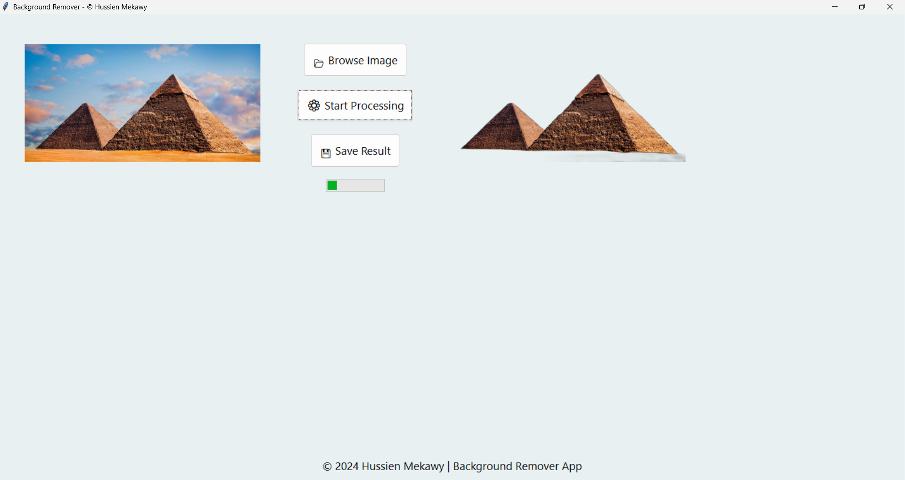

# Background Remover App

This application provides a user-friendly GUI to remove the background from images. It organizes original and processed images into separate folders for easy management.

---

## Features

- **Image Browsing**: Easily browse and load images for processing.
- **Background Removal**: Processes images and removes backgrounds using the `rembg` library.
- **Automatic Folder Organization**:
  - Original images are saved in the `before/` folder.
  - Processed images are saved in the `output/` folder.
- **Modern GUI**: Built with `tkinter` for a responsive and user-friendly interface.
- **Progress Feedback**: Indicates when the background removal process is ongoing.

---

## Installation

### 1. Prerequisites
- **Python 3.8+**
- **Pip** (Python's package manager)

### 2. Clone the Repository
```bash
git clone https://github.com/hosenmekawy/background-removal.git
cd background-removal
```

### 3. Install Required Libraries
Run the following commands to install dependencies:

#### Install Required Libraries:
```bash
pip install pillow rembg tkinter shutil threading onnxruntime
```

#### Install `tkinter` (if not already installed):
- For **Ubuntu/Linux**:
  ```bash
  sudo apt-get install python3-tk
  ```
- For **Windows**:
  - `tkinter` comes pre-installed with Python. No additional steps are required.

#### Install `onnxruntime` (for CPU):
```bash
pip install onnxruntime
```

---

## How to Run

### 1. Run the App
Execute the following command in the project directory:
```bash
python app.py
```

### 2. Use the App
- Click **Browse Image** to select an image.
- Click **Start Processing** to remove the background.
- The original image will be saved in the `before/` folder.
- The processed image will be saved in the `output/` folder.

---

## GPU Acceleration

To enable GPU acceleration for faster processing:

### 1. Install GPU-Supported `onnxruntime`
Uninstall the CPU version and install the GPU-enabled version:
```bash
pip uninstall onnxruntime
pip install onnxruntime-gpu
```

### 2. Verify GPU Setup
Ensure you have a compatible NVIDIA GPU and CUDA installed. Follow the [CUDA Installation Guide](https://developer.nvidia.com/cuda-toolkit).

---

## Folders

- **`before/`**: Contains the original input images.
- **`output/`**: Contains the processed images with backgrounds removed.

---

## Libraries Used

- **`Pillow`**: For image manipulation and display.
- **`rembg`**: To remove backgrounds from images.
- **`tkinter`**: For building the graphical user interface.
- **`shutil`**: For managing file operations.
- **`threading`**: To run background tasks without freezing the GUI.
- **`onnxruntime`**: For running AI-based background removal efficiently.

---

## Screenshots


### 1. **Processing Example**


---

## Support
For any issues or suggestions, please contact [Hussien Mekawy](mailto:hussienmekawy38@gmail.com).

